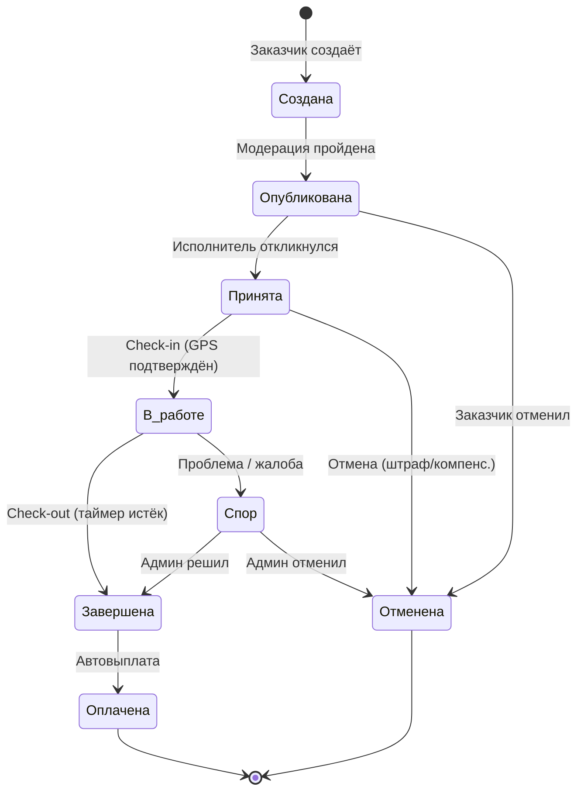

# ТЕХНИЧЕСКОЕ ЗАДАНИЕ

## Платформа Управления Мобильными Ресурсами — CORE V1.0

|                     |                                       |
| ------------------- | ------------------------------------- |
| **Проект**          | WorkFlow KG                           |
| **Версия ТЗ**       | 1.0                                   |
| **Дата**            | 25 марта 2026 г.                      |
| **Срок реализации** | 3-4 месяца (MVP)                      |
| **Бюджет**          | 120 000 сом (MVP)                     |
| **Стек**            | Flutter, Node.js, PostgreSQL, MongoDB |

---

## 1. Общее описание

### 1.1. Назначение системы

Платформа для управления краткосрочными задачами (гиг-экономика), связывающая **Заказчиков** (бизнесы) и **Исполнителей** (физ. лица) с автоматическим гео-контролем, верификацией личности и финансовыми расчётами.

### 1.2. Целевая аудитория

| Роль                      | Описание                     | Примеры                                      |
| ------------------------- | ---------------------------- | -------------------------------------------- |
| **Исполнители (Agents)**  | Физ. лица, ищущие подработку | Официанты, курьеры, промоутеры, разнорабочие |
| **Заказчики (Merchants)** | ИП и ОсОО                    | Рестораны, кафе, магазины, event-компании    |
| **Администратор**         | Владелец платформы           | Управление, модерация, аналитика             |

### 1.3. География

Кыргызская Республика (первичный запуск — г. Бишкек).

---

## 2. Модуль идентификации и верификации (Trust & Safety)

### 2.1. Регистрация Исполнителей (Agent)

**Обязательные данные:**

- Номер телефона (SMS-подтверждение)
- ФИО (заполняется вручную или через MBANK ID\*)
- Фото профиля (селфи)
- Категории работы (общепит, курьерство, event и т.д.)

**MBANK ID Verification (Phase 2+):**

> В MVP — ручная верификация администратором.
> В будущем — автоматическая верификация через банковский API с получением подтверждённых ФИО.

- Выплаты разрешены только на верифицированную карту
- Один аккаунт = один банковский ID

**Медкнижка (Health Pass):**

- Обязательно для категории «Общепит»
- Загрузка фото/скана действующей медкнижки
- Система хранит дату выдачи и срок действия
- Автоматическое уведомление за **7 дней** до истечения
- Автоблокировка доступа к заказам категории «Общепит» при отсутствии или истечении медкнижки

**Device ID Binding:**

- Привязка аккаунта к Hardware ID устройства
- Один смартфон = один аккаунт
- При смене устройства — запрос подтверждения через SMS + админ

### 2.2. Регистрация Заказчиков (Merchant)

**Обязательные данные:**

- Название бизнеса
- ИНН ИП или ОсОО
- Контактное лицо + телефон
- Адрес (юридический и фактический)

**B2B Compliance:**

> В MVP — ручная проверка ИНН администратором.
> В будущем — программная валидация через реестры ГНС/Минюста.

**Договор-оферта:**

> В MVP — статичный PDF-шаблон с подстановкой реквизитов.
> В будущем — полная авто-генерация индивидуального договора.

---

## 3. Модуль задач (Core)

### 3.1. Создание задачи (Merchant)

Заказчик заполняет:

| Поле                | Тип                 | Обязательное | Описание                                   |
| ------------------- | ------------------- | ------------ | ------------------------------------------ |
| Название            | string              | ✅           | Краткое описание задачи                    |
| Описание            | text                | ✅           | Подробности, требования                    |
| Категория           | enum                | ✅           | Общепит, Курьер, Event, Разнорабочий и др. |
| Адрес               | string + координаты | ✅           | Место выполнения (с выбором на карте)      |
| Дата и время начала | datetime            | ✅           | Когда нужен исполнитель                    |
| Длительность        | hours               | ✅           | Сколько часов работы                       |
| Оплата              | number (сом)        | ✅           | Сумма вознаграждения                       |
| Кол-во исполнителей | number              | ✅           | Сколько человек нужно                      |
| Требования          | text                | ❌           | Опыт, медкнижка, внешний вид и т.д.        |
| Фото объекта        | image[]             | ❌           | Фото места работы                          |

### 3.2. Поиск и принятие задач (Agent)

- Исполнитель видит список доступных задач с фильтрами:
  - По категории
  - По дате
  - По оплате (от/до)
  - По расстоянию от текущего местоположения
- Карточка задачи содержит: название, оплата, адрес (на карте), время, требования
- Кнопка «Откликнуться» / «Принять задачу»
- После принятия задача закрепляется за исполнителем

### 3.3. Жизненный цикл задачи



### 3.4. Статусы задачи

| Статус        | Описание                               |
| ------------- | -------------------------------------- |
| `DRAFT`       | Черновик (не опубликована)             |
| `PUBLISHED`   | Опубликована, доступна исполнителям    |
| `ACCEPTED`    | Принята исполнителем, ожидает check-in |
| `IN_PROGRESS` | Исполнитель на месте, работает         |
| `COMPLETED`   | Задача завершена                       |
| `PAID`        | Оплата исполнителю произведена         |
| `DISPUTED`    | Спор (требует решения админа)          |
| `CANCELLED`   | Отменена                               |

---

## 4. Гео-контроль и антифрод (Core Engine)

### 4.1. Гео-фенсинг (Geo-Fencing)

**Check-in (начало работы):**

- Исполнитель нажимает «Начал работу» в приложении
- Система проверяет GPS-координаты устройства
- Активация возможна **только в радиусе ≤50 метров** от координат задачи
- При нахождении вне зоны — отказ с сообщением: _"Вы слишком далеко от места работы"_

**Live Uptime Tracking (мониторинг присутствия):**

> В MVP — базовая проверка при check-in и check-out.
> В будущем — фоновый GPS-мониторинг каждые 5-10 минут.

- Логирование координат в MongoDB
- Отметка статуса: `IN_ZONE` / `OUT_OF_ZONE`

**Check-out (завершение работы):**

- Доступен только после истечения таймера сессии
- Фиксация времени и координат выхода
- Автоматический триггер на выплату

### 4.2. Защита от манипуляций

> В MVP — базовая проверка. Полный антифрод — Phase 2+.

| Механизм                      | MVP                 | Phase 2+             |
| ----------------------------- | ------------------- | -------------------- |
| Anti-Mock Location (Fake GPS) | ⚠️ Базовая проверка | ✅ Полная блокировка |
| Root/Jailbreak Detection      | ❌                  | ✅ Запрет работы     |
| Server Time Sync              | ✅ Да               | ✅ Да                |
| Device ID Binding             | ✅ Да               | ✅ Да                |

---

## 5. Финансовый модуль (Fintech & Escrow)

> **⚠️ В MVP:** Финансовый модуль реализован в виде **внутреннего баланса** с **заглушками** для банковских API. Реальные интеграции — отдельный этап.

### 5.1. Виртуальный баланс

**Баланс Заказчика (Merchant):**

- При регистрации баланс = 0
- Пополнение: банковский перевод / карта (в MVP — ручное зачисление админом)
- Списание: заморозка средств при публикации задачи
- Отображение: текущий баланс, замороженные средства, история операций

**Баланс Исполнителя (Agent):**

- Начисление после завершения задачи
- Вывод средств: на карту Элкарт/Visa (в MVP — ручная выплата)
- История: все операции с датами и суммами

### 5.2. Логика Escrow

```
Заказчик создаёт задачу (1000 сом)
    │
    ▼
Исполнитель принимает задачу
    │
    ▼
HOLD: Заморозка 1000 сом + комиссия платформы (например, 15% = 150 сом)
    │  Итого заморожено: 1150 сом
    │
    ├── ✅ Успешное завершение (check-out):
    │       → 1000 сом → баланс Исполнителя
    │       → 150 сом → доход платформы
    │
    ├── ❌ Отмена Заказчиком (< 3ч до начала):
    │       → Компенсация Исполнителю (% от суммы)
    │       → Остаток → возврат Заказчику
    │
    └── ⚠️ Спор:
            → Средства заморожены до решения админа
```

### 5.3. Комиссия платформы

| Параметр                 | Значение                                         |
| ------------------------ | ------------------------------------------------ |
| Комиссия с Заказчика     | 10-15% от суммы задачи (настраивается в админке) |
| Комиссия с Исполнителя   | 0% (в MVP)                                       |
| Минимальная сумма задачи | 200 сом                                          |

### 5.4. Payout (Выплаты)

> **MVP:** Админ вручную переводит деньги по заявкам на вывод.
> **Phase 2+:** Автоматический пayout через API MBANK на карты Элкарт/Visa.

---

## 6. Дисциплинарный модуль (Rules Engine)

### 6.1. Система штрафов

| Нарушение                   | Санкция                                | Данные            |
| --------------------------- | -------------------------------------- | ----------------- |
| **Опоздание**               | Вычет из оплаты (% за каждую минуту)   | GPS + Server Time |
| **Выход из гео-зоны**       | Предупреждение → штраф → аннулирование | GPS Log           |
| **Неявка**                  | Бан на 24ч + снижение рейтинга         | —                 |
| **Отмена (Исполнитель)**    | Снижение рейтинга, при повторе — бан   | —                 |
| **Отмена (Заказчик, < 3ч)** | Компенсация Исполнителю                | —                 |

### 6.2. Рейтинговая система

- Исполнитель: ⭐ 1-5 (ставит Заказчик после задачи)
- Заказчик: ⭐ 1-5 (ставит Исполнитель после задачи)
- Рейтинг влияет на приоритет в выдаче задач

### 6.3. Бан-система

| Уровень        | Условие       | Действие             |
| -------------- | ------------- | -------------------- |
| Предупреждение | 1-2 нарушения | Уведомление          |
| Временный бан  | 3-4 нарушения | Блокировка на 7 дней |
| Постоянный бан | 5+ нарушений  | Чёрный список по ИНН |

---

## 7. Админ-панель (Web Dashboard)

### 7.1. Страницы админ-панели

| Раздел           | Функционал                                                        |
| ---------------- | ----------------------------------------------------------------- |
| **Dashboard**    | GTV (оборот), чистая прибыль, кол-во задач, активные пользователи |
| **Пользователи** | Список Agent/Merchant, верификация, бан/разбан                    |
| **Задачи**       | Все задачи, фильтры по статусу, модерация                         |
| **Финансы**      | Балансы, транзакции, заявки на вывод, ручное зачисление           |
| **Споры**        | Открытые споры, решение, возвраты                                 |
| **Настройки**    | Комиссия, радиус гео-зоны, лимиты штрафов                         |

### 7.2. Ключевые метрики Dashboard

- **GTV (Gross Transaction Value)** — общий оборот платформы
- **Net Revenue** — чистая прибыль (комиссии)
- **Кол-во задач** — создано / выполнено / отменено
- **Кол-во пользователей** — зарегистрировано / верифицировано / забанено
- **Средний чек** — средняя стоимость задачи
- **Conversion Rate** — % откликов → принятий

---

## 8. Отчётность и документооборот

### 8.1. Для Заказчиков

> **MVP:** Базовый отчёт в виде таблицы в приложении.
> **Phase 2+:** PDF-генерация.

- **Акт выполненных работ** — генерируется по каждой закрытой задаче
- Содержит: дата, ФИО исполнителя, описание работы, сумма, подписи сторон

### 8.2. Для Администратора

- Выгрузка реестра транзакций (CSV/Excel)
- Совместимость с ЭСФ (электронные счета-фактуры) — Phase 2+

---

## 9. UI/UX дизайн

### 9.1. Принципы дизайна

- **Минимализм** — максимум 2-3 действия до цели
- **Тёмная/светлая тема** — переключение
- **Яркие акценты** — градиенты, микро-анимации
- **Адаптивность** — телефоны от 4.7" до 6.7"+
- **Язык** — русский (основной), кыргызский (Phase 2+)

### 9.2. Ключевые экраны (Agent)

1. **Онбординг** — 3 слайда с описанием сервиса
2. **Регистрация / Логин** — телефон + SMS
3. **Главная** — список доступных задач (карточки)
4. **Карта** — задачи на карте рядом с текущим местоположением
5. **Детали задачи** — полная информация + кнопка «Принять»
6. **Активная задача** — таймер, кнопка check-in/check-out, карта
7. **Профиль** — данные, рейтинг, медкнижка, баланс
8. **Кошелёк** — баланс, история, вывод средств
9. **История** — завершённые задачи

### 9.3. Ключевые экраны (Merchant)

1. **Регистрация / Логин** — телефон + данные бизнеса
2. **Главная** — мои задачи (активные, прошлые)
3. **Создание задачи** — форма с выбором на карте
4. **Детали задачи** — статус, назначенный исполнитель, GPS на карте
5. **Профиль бизнеса** — данные, рейтинг, баланс
6. **Кошелёк** — баланс, пополнение, история списаний

---

## 10. Нефункциональные требования

### 10.1. Производительность

| Параметр                    | Требование                |
| --------------------------- | ------------------------- |
| Время ответа API            | < 500мс (95-й перцентиль) |
| Одновременных пользователей | до 500 (MVP)              |
| Частота GPS-запросов        | 1 раз в 5-10 минут        |

### 10.2. Безопасность

- HTTPS для всех запросов
- JWT-токены с ротацией (Access + Refresh)
- Хэширование паролей (bcrypt)
- Rate limiting на API
- Валидация всех входных данных (Zod)
- CORS-политика

### 10.3. Совместимость

| Платформа          | Минимальная версия                  |
| ------------------ | ----------------------------------- |
| Android            | 6.0+ (API 23)                       |
| iOS                | 13.0+                               |
| Браузеры (админка) | Chrome 90+, Safari 14+, Firefox 88+ |

---

## 11. Инфраструктура и деплой

| Компонент         | Решение                     | Стоимость       |
| ----------------- | --------------------------- | --------------- |
| **VPS сервер**    | Hetzner / DigitalOcean      | ~$5-15/мес      |
| **БД PostgreSQL** | На том же VPS (MVP)         | Включено        |
| **MongoDB**       | MongoDB Atlas Free / на VPS | Бесплатно (MVP) |
| **CI/CD**         | GitHub Actions              | Бесплатно       |
| **Мониторинг**    | UptimeRobot (бесплатно)     | Бесплатно       |
| **Google Play**   | Аккаунт разработчика        | $25 (разово)    |
| **App Store**     | Apple Developer Program     | $99/год         |
| **Домен**         | .kg или .com                | ~$10-30/год     |

---

## 12. Этапы и оплата

### 12.1. График работ

| Этап              | Недели | Результат                                          |
| ----------------- | ------ | -------------------------------------------------- |
| **Аванс + Старт** | 1-2    | Дизайн (Figma), архитектура, БД, настройка сервера |
| **Backend API**   | 3-5    | Авторизация, задачи, профили, базовый гео          |
| **Flutter App**   | 5-9    | Приложение для Agent + Merchant                    |
| **Админ-панель**  | 9-11   | Веб-дашборд администратора                         |
| **Тестирование**  | 11-12  | QA, багфиксы, полировка                            |
| **Публикация**    | 12-13  | Деплой на сервер, Play Market, App Store           |

### 12.2. Оплата

| Этап      | Сумма           | Условие                     |
| --------- | --------------- | --------------------------- |
| Аванс     | 30 000 сом      | До начала работ             |
| Этап 1    | 30 000 сом      | Сдача Backend API + Auth    |
| Этап 2    | 30 000 сом      | Сдача Flutter App + Админка |
| Этап 3    | 30 000 сом      | Публикация в сторы          |
| **Итого** | **120 000 сом** |                             |

> Инфраструктурные расходы (серверы, аккаунты, домен) оплачиваются Заказчиком отдельно.

### 12.3. Условия

- **Scope freeze:** Всё, что не описано в данном ТЗ — дополнительное соглашение и отдельная оплата.
- **Обратная связь:** Заказчик обязуется давать фидбек по каждому этапу в течение **2-3 рабочих дней**.
- **API-зависимость:** Сроки интеграций с внешними API (MBANK, ГНС) зависят от скорости предоставления доступа этими организациями.
- **Права на код:** Полные права на исходный код переходят Заказчику после полной оплаты.

---

## 13. Разграничение MVP и Phase 2+

| Функционал                    | MVP (120k)        | Phase 2+ (отдельно)   |
| ----------------------------- | ----------------- | --------------------- |
| Регистрация / Логин           | ✅ SMS            | MBANK ID              |
| Профили Agent / Merchant      | ✅                | —                     |
| Медкнижка (загрузка)          | ✅                | Авто-валидация        |
| Создание / принятие задач     | ✅                | —                     |
| GPS Check-in / Check-out      | ✅                | Фоновый трекинг 24/7  |
| Anti-Fake GPS                 | ⚠️ Базово         | Полный антифрод       |
| Root/Jailbreak Detection      | ❌                | ✅                    |
| Баланс (внутренний)           | ✅                | —                     |
| Escrow (заморозка/разморозка) | ✅ Внутренний     | Реальный банковский   |
| Выплаты                       | ⚠️ Ручные (админ) | Авто через MBANK API  |
| Штрафы                        | ⚠️ Базовые        | Полный Rules Engine   |
| Рейтинг                       | ✅                | —                     |
| Бан-система                   | ✅                | По ИНН через ГНС      |
| Админ-панель                  | ✅ Базовая        | Расширенная аналитика |
| PDF (акты, договоры)          | ❌                | ✅                    |
| Push-уведомления              | ✅ Firebase       | —                     |
| Выгрузка для ГНС / ЭСФ        | ❌                | ✅                    |
| Кыргызский язык               | ❌                | ✅                    |

---

_Документ составлен на основании первичного ТЗ Заказчика и консультаций по бюджету, срокам и техническому скоупу. Является основой для разработки MVP._
